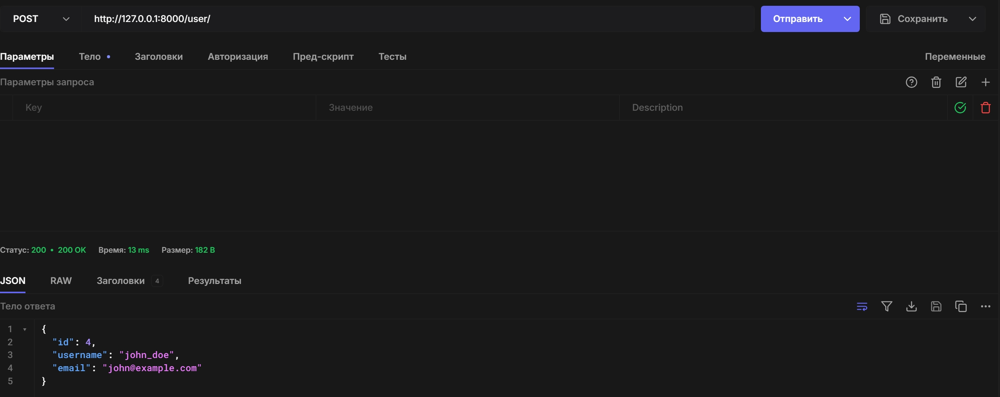
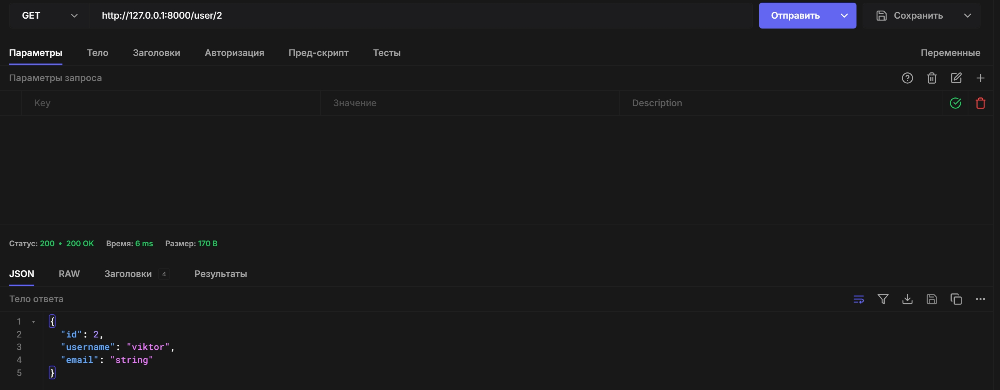
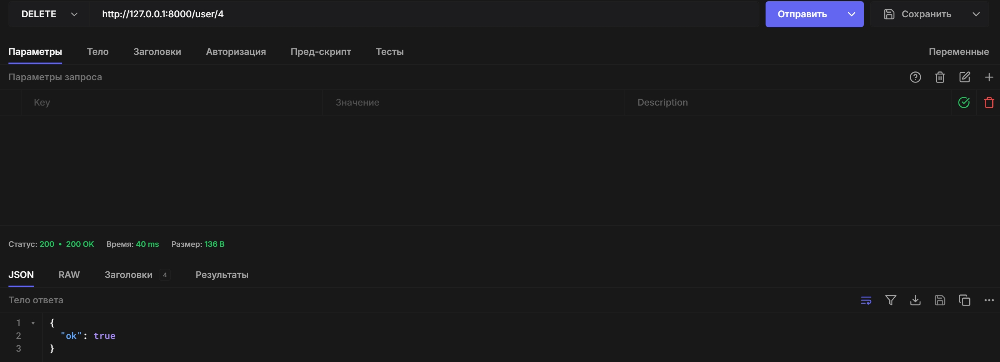
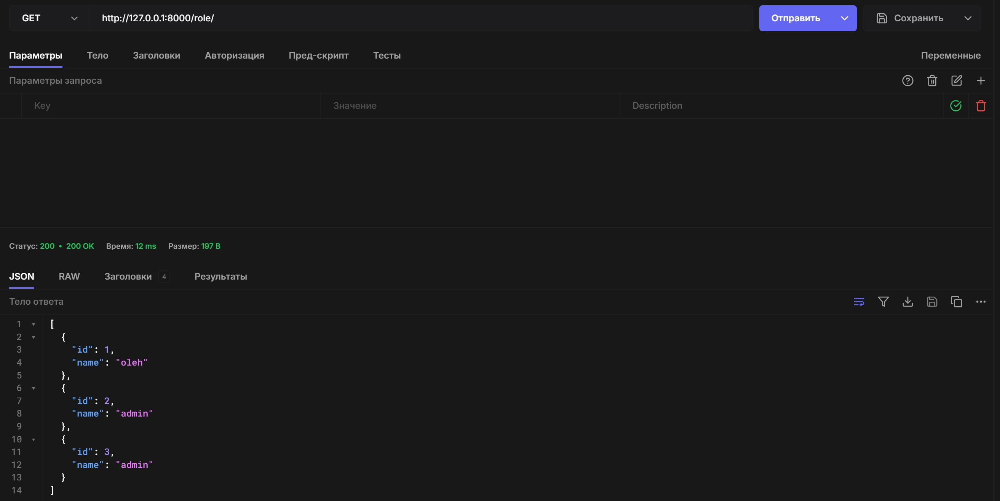
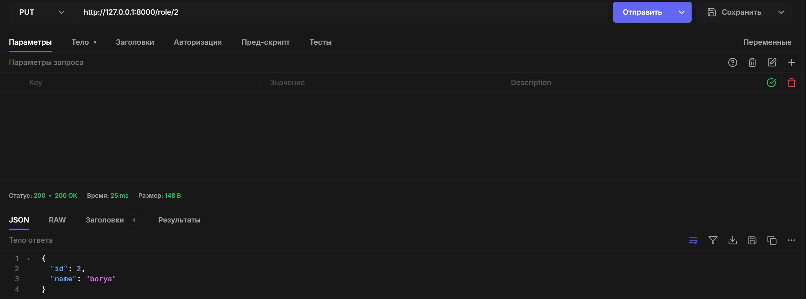
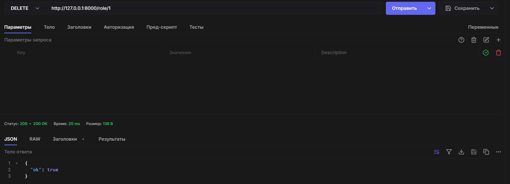
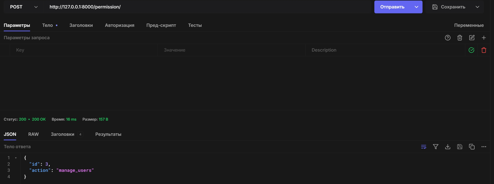
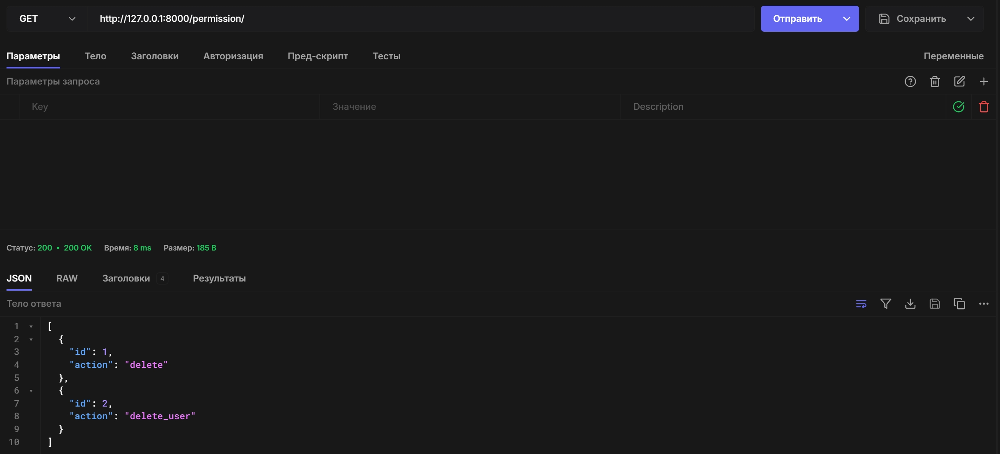
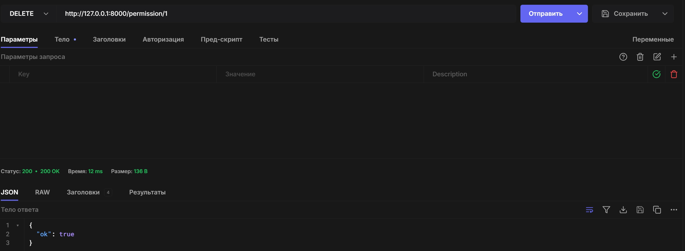

# Тестування працездатності системи

## Передумови

### 1. Встановити залежності проєкту

```bash
pip install -U fastapi
pip show fastapi
pip install uvicorn
```

### 2. Запустити сервер

```bash
uvicorn src.api.main:app --reload
```

## Перевірка працездатності сервісів

### POST: Створити користувача



### GET: Отримати список всіх користувачів



### PUT: Оновити користувача


### DELETE: Видалити користувача



### POST: Створити роль


### GET: Отримати усі ролі



### PUT: Оновити роль



### DELETE: Видалити роль



### POST: Створити дозвіл



### GET: Отримати всі дозволи



### PUT: Оновити дозвіл     


### DELETE: Видалити дозвіл

